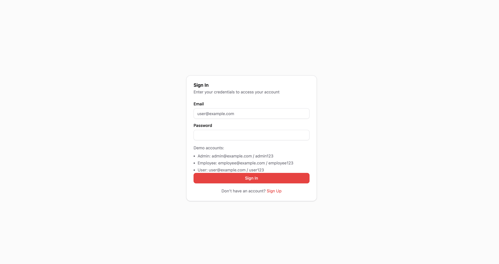
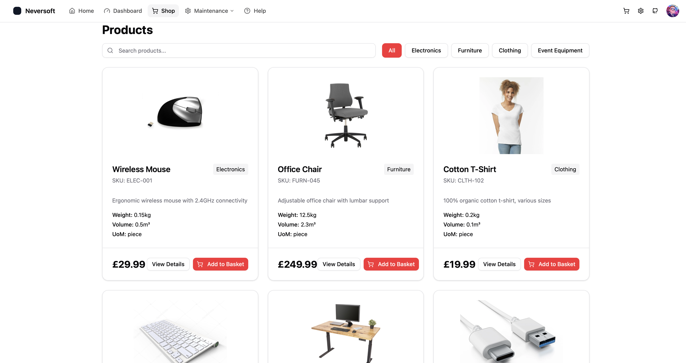
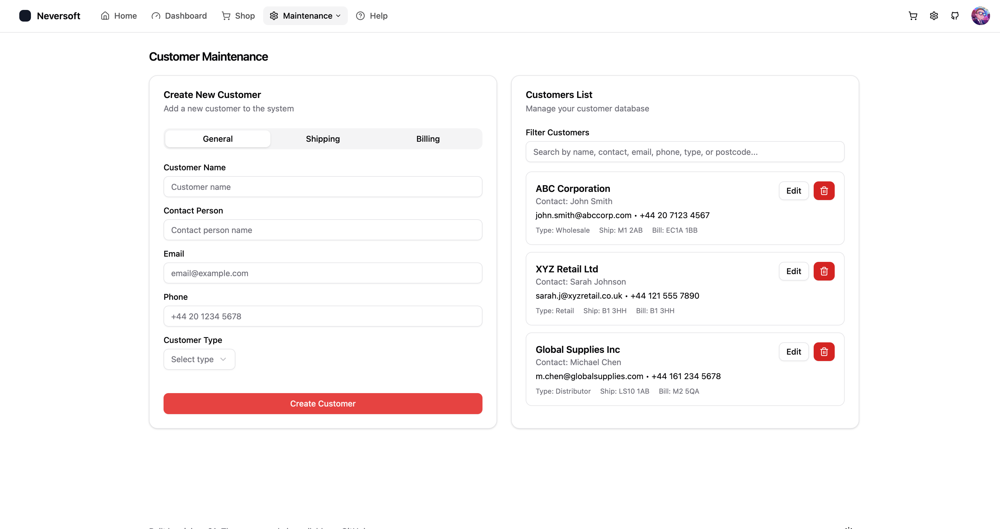
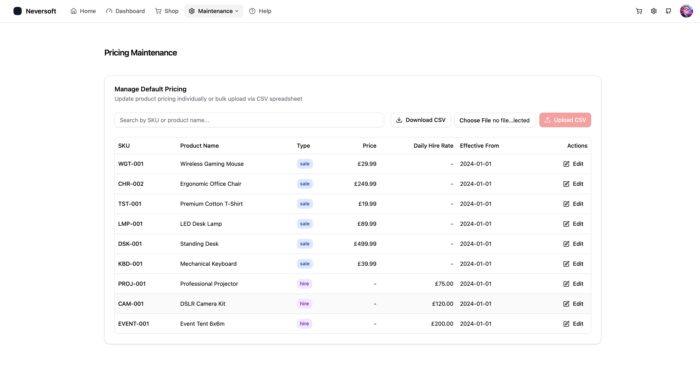
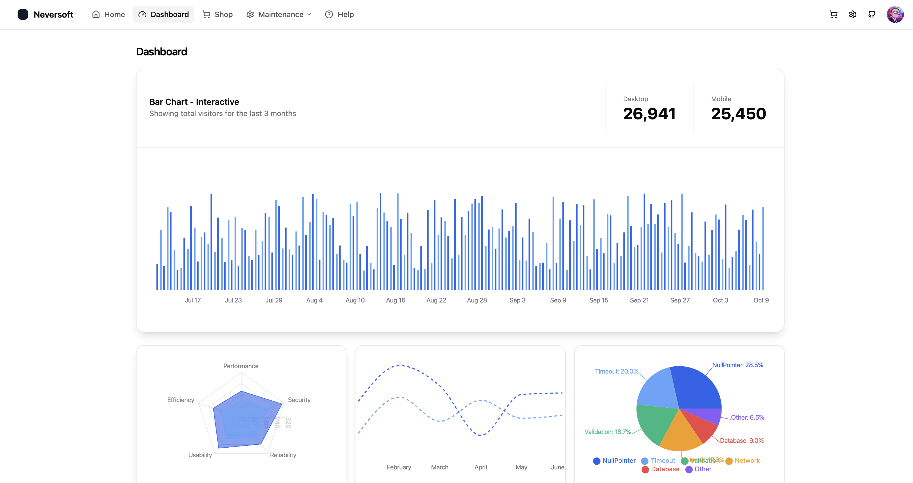

# Technology

React + Vite + TypeScript with shadcn/ui.

## Gallery

### Sign In


### Shopping


### Customer Maintenance


### Pricing Maintenance


### Management Info



## Getting Started

```bash
cd my-project
npm install
npm run dev
```

## Getting Done

- [x] Single page app with navigation and responsif layout
- [x] Customable configuration `/config`
- [x] Simple starting page/feature `/pages`
- [x] Github action deploy github pages

## Deploy `gh-pages`

- change `basenameProd` in `/vite.config.ts`
- create deploy key `GITHUB_TOKEN` in github `/settings/keys`
- commit and push changes code
- setup gihub pages to branch `gh-pages`
- run action `Build & Deploy`

### Auto Deploy

- change file `.github/workflows/build-and-deploy.yml`
- Comment on `workflow_dispatch`
- Uncomment on `push`

```yaml
# on:
#   workflow_dispatch:
on:
  push:
    branches: ["main"]
```

## Features

- React + Vite + TypeScript
- Tailwind CSS
- [shadcn-ui](https://github.com/shadcn-ui/ui/)
- [react-router-dom](https://www.npmjs.com/package/react-router-dom)

## Project Structure

```md
react-shadcn-starter/
├── public/            # Public assets
├── src/               # Application source code
│   ├── assets/        # Static assets (images, etc.)
│   │   └── images/    # Image assets
│   │       └── products/  # Product images
│   ├── components/    # React components
│   ├── context/       # contexts components
│   ├── config/        # Config data
│   ├── hook/          # Custom hooks
│   ├── lib/           # Utility functions
│   ├── pages/         # pages/features components
│   ├── App.tsx        # Application entry point
│   ├── index.css      # Main css and tailwind configuration
│   ├── main.tsx       # Main rendering file
│   └── Router.tsx     # Routes component
├── index.html         # HTML entry point
├── tsconfig.json      # TypeScript configuration
└── vite.config.ts     # Vite configuration
```

## Product Images

Product images are stored in `src/assets/images/products/` and are referenced in the product data by filename.

### Image Naming Convention

Product images should follow these naming conventions:

- **Primary Image**: `{SKU}.{extension}` (e.g., `ELEC-001.jpg`, `FURN-045.png`)
- **Additional Images**: `{SKU}-{index}.{extension}` (e.g., `ELEC-001-1.jpg`, `ELEC-001-2.jpg`)

### Supported Formats

- JPG/JPEG (`.jpg`, `.jpeg`)
- PNG (`.png`)
- WebP (`.webp`)
- SVG (`.svg`)

### Adding New Product Images

1. Place your image files in `src/assets/images/products/`
2. Name them according to the product SKU (e.g., `ELEC-001.jpg`)
3. Update the product data to reference the image:

```typescript
{
    product_id: 1,
    sku: "ELEC-001",
    name: "Wireless Mouse",
    // ... other fields
    image: "ELEC-001.jpg",  // Primary image
    images: ["ELEC-001.jpg", "ELEC-001-1.jpg", "ELEC-001-2.jpg"]  // Multiple images for carousel
}
```

### Image Display Locations

- **Product Cards** (Products page): Shows the primary image in a fixed 48px height container
- **Product Detail Page**:
  - Large image display with aspect-square ratio
  - Image carousel with thumbnail navigation (when multiple images are provided)
  - Click thumbnails to switch between images
- **Order Detail Page**: Small 64x64px thumbnail next to each order line item

### Fallback Image

If a product has no image specified or the image file is not found, the system automatically displays a placeholder image (`no-image.svg`).

## Diagrams


## License

This project is licensed under the MIT License. See the [LICENSE](https://github.com/hayyi2/react-shadcn-starter/blob/main/LICENSE) file for details.
